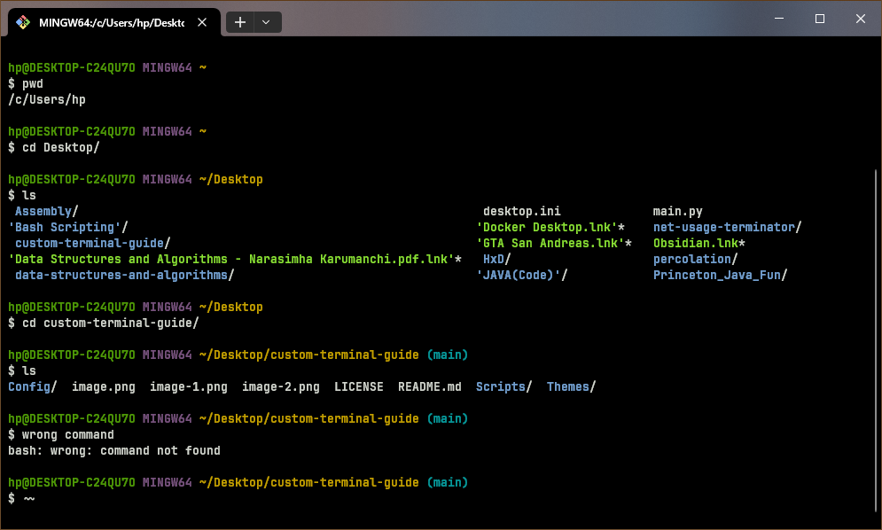
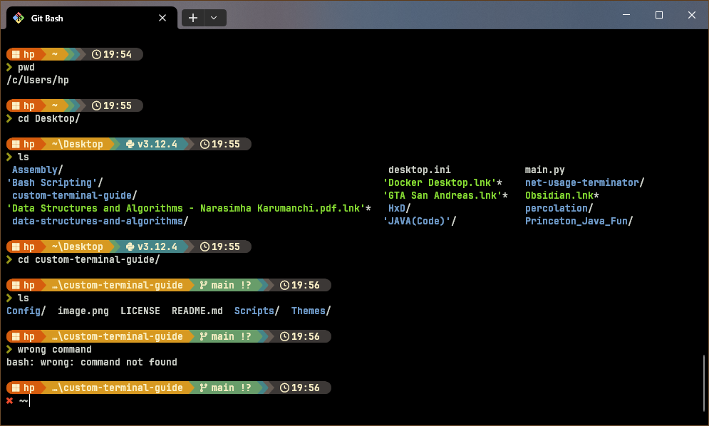
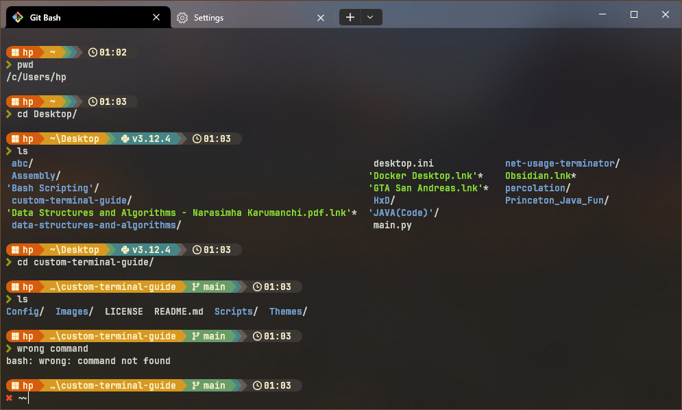

# Custom Terminal 🖥️ Guide 📋
    
## Introduction
     
> Note : This repository is mainly intended to be used as a **safehouse** (for now) for my terminal customizations and settings.<br> 
    
        
If you follow the instructions laid down here, you can change your terminal, that may look like this 👇
     

    
Into something that looks like this 👇
    


Or this 👇


     
## Installation
      
### Prerequisites
     
[**Nerd Fonts**](https://www.nerdfonts.com/) : You can download these fonts from [**here**](https://www.nerdfonts.com/font-downloads). I use the [J**etBrains Mono Nerd Font**](https://github.com/ryanoasis/nerd-fonts/releases/download/v3.2.1/JetBrainsMono.zip) for my terminal.
    
### STEP 01 : Install Starship 🚀
       
[**Starship**](https://starship.rs/) is a highly customizable, cross-shell prompt. It works with popular shells like Bash, Zsh, Fish, PowerShell, and others. It will help us in changing the looks of our terminal.
   
#### **Windows OS** 
   
Starship can be installed via `winget`, windows package manager, by running the following command in the `Command Prompt`. It will not work if you do not have `winget` installed already :
    
```
winget install --id Starship.Starship
```
   
If the above command does not work then we have to download the MSI-installers from the [**release section**](https://github.com/starship/starship/releases/tag/v1.20.1) of Starship's Github repository. Make sure to download the correct installer based on your CPU's Instruction Set Architecture (ISA), if you have a `x86_64` system with Windows OS, download the installer that may look like this 👇
     
>
> starship-x86_64-pc-windows-msvc.msi 
>

After downloading is complete, install it like any other program by running the installer.

#### **Linux OS**
   
To install Starship, run the following command in your terminal :
     
```
curl -sS https://starship.rs/install.sh | sh
```
### STEP 02 : Configure Your Shell to Use Starship Prompt
    
We can configure our `Shells` to run the Starship prompt everytime we start a new terminal session.
      
#### **PowerShell**

Open `PowerShell` and run the following command :
   
```
notepad $PROFILE
```

Add the following at the end of the file that was opened by the above command. Save and then close the file :

```
Invoke-Expression (&starship init powershell)
```

#### **Bash**
   
Either you can configure `Bash`, if you are on a Linux system, or you can configure `Git Bash` on a Windows system. The methods for both are exactly the same.

To configure `Bash` we have to make changes to the `.bashrc` file. To achieve that, run the following command :

```
cd ~ && nano .bashrc
```
The comand above checks for the `.bashrc` file in the `/usr/home/` directory (user's home directry) and opens it via `nano` (text editor that runs in the terminal). If the `.bashrc` file does not exist in the user's home directory `nano` creates it first and then opens it.

Add the following at the end of the `.bashrc` file :

```
eval "$(starship init bash)"
```
     
Everything is done! Restart the terminal and you should see it in a new look. Your `Shell` will load the default Starship prompt, if you are not happy with the look then proceed on with the next step.
  
### STEP 03 : Configuring the Startship Prompt

Configurations for Starship are done in a `starship.toml` file located in `.config` folder in the user's home directory. We need to create them first by running the following commands :

> Note : use `Git Bash` or `Bash` to run this command.
```
mkdir -p ~/.config && touch ~/.config/starship.toml
```

Now we can start configuring by adding content to the `starship.toml` file. To learn about this in detail, check the [**Documentation**](https://starship.rs/config/#prompt). Now, manually configuring the prompt is a bit tedious. So, we are going to use some [**Presets**](https://starship.rs/presets/#nerd-font-symbols). Choose any preset that you like and copy its `toml` into `starship.toml`, that we created earlier, save it and the configurations will be applied. 
    
To get the same prompt as shown in this [**image**](Images/terminal-after-customization.png), copy [**this**](Themes/Starship/starship.toml) into your `starship.toml` file.
